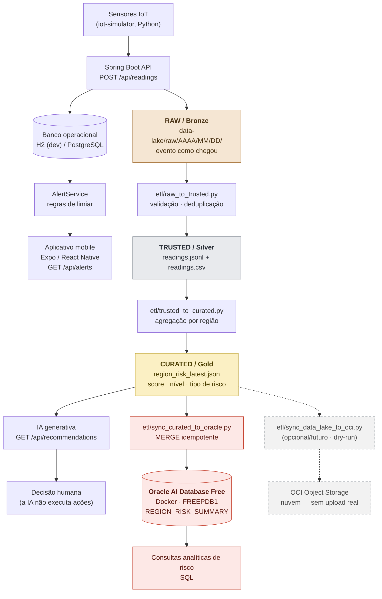

# Orbital Alert

Monitoramento preventivo de **enchentes** com sensores IoT, Data Lake, score de risco,
IA de apoio à decisão e persistência analítica em **Oracle AI Database Free**.

> **MVP acadêmico — FIAP, Global Solution 2026.** Não é um sistema em produção: não há deploy
> público, os dados de sensores vêm de um simulador e o objetivo é demonstrar a arquitetura
> ponta a ponta de forma reproduzível na máquina de qualquer avaliador.

---

## Visão geral

O Orbital Alert observa regiões vulneráveis por meio de sensores (nível de água, chuva,
temperatura, fumaça, umidade), guarda cada leitura recebida, calcula um **score de risco por
região** e gera **alertas** que chegam ao aplicativo mobile.

O sistema tem dois caminhos que rodam em paralelo e não dependem um do outro:

| Caminho | O que faz | Se parar… |
|---|---|---|
| **Operacional** | Recebe a leitura, grava no banco, aplica as regras de limiar e emite o alerta | O produto para — é o coração do sistema |
| **Analítico** | Guarda o histórico em Data Lake, calcula o score de risco, alimenta a IA e o Oracle | O produto continua funcionando normalmente |

Essa separação é proposital: o alerta que protege pessoas nunca pode depender de um ETL, de uma
IA ou de um banco analítico estar no ar.

## Problema priorizado: enchentes

Enchentes e alagamentos são o evento climático de maior recorrência e impacto nas regiões
estudadas. Por isso **esta fase demonstra o caso de uso de enchente**: os sensores
`WATER_LEVEL` (nível do rio) e `RAINFALL` (volume de chuva) alimentam o risco do tipo `FLOOD`,
e as evidências do repositório seguem esse cenário.

**Isso é uma escolha de caso de uso, não uma limitação técnica.** O suporte a incêndio
(`TEMPERATURE`, `SMOKE`, `HUMIDITY` → risco `FIRE`) continua íntegro no backend, no simulador,
nos ETLs e no modelo de risco — basta cadastrar sensores desse tipo.

## Proposta de valor

1. **Antecipação, não constatação.** O alerta é disparado quando a leitura cruza o limiar, e o
   score de risco considera a **tendência** — uma região com chuva subindo pontua mais do que
   uma região estável no mesmo valor.
2. **Decisão apoiada, nunca automatizada.** A IA generativa produz uma recomendação em
   linguagem clara para a defesa civil. Ela **não** aciona sirene, não evacua ninguém e não
   altera nenhum dado: todos os endpoints de recomendação são somente leitura. A decisão
   crítica continua sendo humana.
3. **Histórico auditável.** Toda leitura fica gravada exatamente como chegou (camada RAW,
   imutável). Se uma regra de qualidade mudar, o histórico inteiro pode ser reprocessado.
4. **Reproduzível.** Backend, simulador, ETLs, testes e mobile rodam offline. O banco Oracle
   sobe com um `docker run`.

## Arquitetura



Em texto:

```text
Sensores IoT / simulador Python
        ↓
Spring Boot API
        ├──→ H2/PostgreSQL → AlertService → Alert → Mobile
        │
        └──→ RAW → TRUSTED → CURATED → Risk Score → recomendação IA
                                   └──→ Oracle AI Database Free
```

## Fluxo em tempo real

1. O sensor (ou o simulador) envia `POST /api/readings`.
2. A API grava a leitura no **banco operacional** (H2 em `dev`, PostgreSQL na modelagem oficial).
3. O **`AlertService`** compara o valor com o limiar do tipo de sensor. Se cruzar, cria um
   `Alert` com nível de risco.
4. O aplicativo mobile consome `GET /api/alerts` e mostra os alertas ativos.
5. **Em paralelo e sem bloquear a resposta**, a mesma leitura é anexada à camada RAW do
   Data Lake.

O passo 5 é assíncrono ao resultado: se o Data Lake falhar, o `POST /api/readings` responde
normalmente e o alerta é gerado do mesmo jeito.

## Data Lake: RAW / TRUSTED / CURATED

| Camada | Conteúdo | Garantias |
|---|---|---|
| **RAW** (Bronze) | Evento exatamente como chegou, JSON Lines particionado por data | Imutável, append-only. Pode ter duplicata e valor absurdo |
| **TRUSTED** (Silver) | Eventos validados, deduplicados e padronizados + relatório de qualidade | Tipos corretos, rejeitados registrados em `_quality/` |
| **CURATED** (Gold) | Um agregado por região: score, nível e tipo de risco, com os indicadores por sensor | Pronto para consumo analítico e para a IA |

Reprocessar é seguro: os ETLs **reescrevem** as saídas em vez de acrescentar, e o RAW nunca é
modificado.

Detalhes em [docs/data-lake-architecture.md](docs/data-lake-architecture.md) e
[docs/data-maintenance.md](docs/data-maintenance.md).

## Risk Score e recomendação

O score de cada região (0–100) combina o **pior indicador** e a **média** dos sensores, com
bônus para tendência de alta:

- peso 0,7 para o maior sub-score, 0,3 para a média;
- `+10` quando a série está subindo (`RISING`);
- nível: `HIGH` ≥ 70, `MEDIUM` ≥ 40, senão `LOW`.

Sobre a camada CURATED, a **IA generativa** monta uma recomendação textual para a defesa civil:

| Método | Rota | Descrição |
|---|---|---|
| `GET` | `/api/recommendations/regions/{regionId}` | Recomendação para uma região |
| `GET` | `/api/recommendations` | Recomendação para todas as regiões |
| `GET` | `/api/recommendations/regions/{regionId}/prompt` | Prompt exato enviado à IA (auditoria) |

Os três são **somente leitura**. O modo padrão é `mock`: determinístico, offline e sem API key.
A integração com LLM externo é opcional e cai automaticamente no mock se a chave faltar ou a
chamada falhar. Exemplo real de prompt e resposta em
[docs/ai-generative-example.md](docs/ai-generative-example.md).

## Integração Oracle AI Database Free

Esta é a **integração Oracle real da Fase 6**: um banco Oracle de verdade, rodando localmente em
Docker, recebendo os dados analíticos da ponta do Data Lake.

```text
CURATED
  ↓
etl/sync_curated_to_oracle.py
  ↓
Oracle AI Database 26ai Free em Docker
  ↓
FREEPDB1
  ↓
REGION_RISK_SUMMARY
```

**O Oracle não substitui o banco operacional.** H2/PostgreSQL continuam atendendo a API, o
`AlertService` e o mobile. O Oracle é uma **persistência analítica complementar** da camada
CURATED — se o contêiner estiver desligado, nada no projeto para de funcionar.

- **Imagem oficial:** `container-registry.oracle.com/database/free:latest-lite`
- **Versão validada:** Oracle AI Database 26ai Free Release 23.26.3.0.0
- **Driver:** `oracledb` (oficial da Oracle, modo *thin* — dispensa Instant Client)
- **Tabela:** `REGION_RISK_SUMMARY`, chave primária `(REGION_ID, GENERATED_AT)`
- **Usuário da aplicação:** `ORBITAL_ALERT`, com apenas `CREATE SESSION` e `CREATE TABLE`
  (a aplicação nunca usa `SYSTEM`)

### Caso real validado neste repositório

| Campo | Valor |
|---|---|
| Região | Margem Rio Tiete - Norte |
| Risk Score | **100** |
| Risk Level | **HIGH** |
| Risk Type | **FLOOD** |
| Dominant Sensor | RAINFALL |
| Registros sincronizados | **1/1** |

A carga usa `MERGE` com chave `(REGION_ID, GENERATED_AT)`: executar o mesmo snapshot de novo
**atualiza a linha em vez de duplicar** (verificado — a tabela permaneceu com 1 registro após a
segunda execução), enquanto uma nova rodada do ETL gera um novo `generatedAt` e vira um novo
registro histórico.

Passo a passo completo em
[docs/oracle-database-integration.md](docs/oracle-database-integration.md).

## Estrutura do repositório

```text
.
├── backend/                # API Spring Boot (Java 21)
├── mobile/                 # App Expo / React Native
├── iot-simulator/          # Simulador de sensores (Python)
├── database/               # Scripts SQL
│   ├── schema.sql
│   ├── seed.sql
│   ├── queries.sql
│   └── oracle-setup.sql          # Fase 6: usuário e tablespace do Oracle local
├── data-lake/              # Fase 5: RAW / TRUSTED / CURATED / samples
├── etl/                    # Fase 5 e 6: scripts Python
│   ├── raw_to_trusted.py
│   ├── trusted_to_curated.py
│   ├── oracle_database.py            # Fase 6: integração Oracle AI Database Free
│   ├── sync_curated_to_oracle.py     # Fase 6: CURATED → Oracle (MERGE idempotente)
│   ├── requirements-oracle-db.txt    # Fase 6: dependência opcional (driver oracledb)
│   ├── oci_storage.py                # Fase 6: integração OCI Object Storage
│   ├── sync_data_lake_to_oci.py      # Fase 6: sincronização do Data Lake (dry-run)
│   ├── requirements-oci.txt          # Fase 6: dependência opcional (SDK oci)
│   └── tests/                        # 56 testes, sem dependência externa
├── docs/
│   ├── evidencias-api/               # Prints do Swagger
│   ├── evidencias-iot/               # Prints do simulador
│   ├── evidencias-oracle-db/         # Prints da integração Oracle
│   ├── oracle-database-integration.md
│   ├── oracle-integration.md
│   ├── data-lake-architecture.md
│   ├── ingestion-flow.md
│   ├── data-maintenance.md
│   ├── ai-generative-example.md
│   ├── documento-final.md
│   └── plano-de-testes.md
├── postman/                # Coleção da API
├── COMO_RODAR.md           # Guia rápido passo a passo
├── .env.example            # Modelo de variáveis (sem segredos)
└── .gitignore
```

## Como executar localmente

Pré-requisitos: **Java 21**, **Python 3.10+**, **Node 18+**, e **Docker Desktop** apenas para a
parte Oracle.

> No Windows, confirme que `JAVA_HOME` aponta para o JDK 21. O `mvnw.cmd` **retorna código de
> saída 0 mesmo quando falha** por `JAVA_HOME` ausente — sempre confira o texto do resultado,
> não só o exit code.

### Backend

```powershell
cd backend
.\mvnw.cmd spring-boot:run "-Dspring-boot.run.profiles=dev"
```

Swagger: <http://localhost:8080/swagger-ui/index.html>

O perfil `dev` usa H2 em memória — sem instalar banco nenhum. A modelagem oficial
(`database/schema.sql`) é PostgreSQL.

### Simulador IoT

```powershell
cd iot-simulator
python -m venv .venv
.venv\Scripts\activate
pip install -r requirements.txt
python sensor_simulator.py
```

Cadastre região e sensor pelo Swagger antes (payloads prontos em
[COMO_RODAR.md](COMO_RODAR.md)).

### ETLs

```powershell
# Fluxo real, com eventos gravados pela API
python etl/raw_to_trusted.py
python etl/trusted_to_curated.py

# Demonstração sem backend, com os dados de exemplo
python etl/raw_to_trusted.py --raw-dir data-lake/samples
python etl/trusted_to_curated.py
```

### Oracle em Docker

Se `docker` não estiver no PATH (instalação por usuário do Docker Desktop):

```powershell
$env:PATH = "$env:LOCALAPPDATA\Programs\DockerDesktop\resources\bin;$env:PATH"
```

Primeira vez:

```powershell
docker pull container-registry.oracle.com/database/free:latest-lite
docker volume create orbital-alert-oracle-data

docker run -d --name orbital-alert-oracle -p 1521:1521 `
  -e ORACLE_PWD="<senha do SYSTEM>" `
  -v orbital-alert-oracle-data:/opt/oracle/oradata `
  container-registry.oracle.com/database/free:latest-lite

docker logs -f orbital-alert-oracle    # espere "DATABASE IS READY TO USE!"
```

Criar o usuário da aplicação (uma única vez — o script pede a senha de forma oculta):

```powershell
Get-Content database/oracle-setup.sql | docker exec -i orbital-alert-oracle `
  sqlplus -S "system/<senha do SYSTEM>@localhost:1521/FREEPDB1"
```

Nas próximas vezes basta `docker start orbital-alert-oracle`.

### Sincronização CURATED → Oracle

```powershell
pip install -r etl/requirements-oracle-db.txt

python etl/sync_curated_to_oracle.py --dry-run      # não abre conexão

$env:ORACLE_DB_PASSWORD = "<senha do ORBITAL_ALERT>"
python etl/sync_curated_to_oracle.py                # carga real, idempotente
```

Saída esperada:

```text
[ORACLE] Regiao 1 | HIGH | FLOOD | score=100 -> OK
Registros gravados  : 1/1
Linhas na tabela    : 1
```

Provar os dados no banco:

```powershell
docker exec -it orbital-alert-oracle sqlplus "ORBITAL_ALERT/<senha>@localhost:1521/FREEPDB1"
```

```sql
SELECT sys_context('USERENV','CON_NAME') AS container_name, USER AS db_user FROM dual;
SELECT COUNT(*) FROM REGION_RISK_SUMMARY;
SELECT * FROM REGION_RISK_SUMMARY;
```

### Mobile

```powershell
cd mobile
npm install
npm run start
```

Abra no Expo Go ou emulador. Por padrão o app roda com **dados mockados**, sem depender do
backend. Para consumir a API real, crie `mobile/.env` a partir de
[mobile/.env.example](mobile/.env.example):

```env
EXPO_PUBLIC_API_BASE_URL=http://SEU_IP_LOCAL:8080
```

Se a API estiver fora do ar, o app volta sozinho para o mock — a demonstração offline nunca
quebra.

## Testes

```powershell
# Backend (Java 21 + JAVA_HOME configurado)
cd backend
.\mvnw.cmd clean compile
$env:SPRING_PROFILES_ACTIVE = "dev"; .\mvnw.cmd test

# ETLs e integrações Oracle — 56 testes, sem exigir banco nem conta Oracle
python -m unittest discover -s etl/tests

# Dry-runs (não acessam banco nem rede)
python etl/sync_curated_to_oracle.py --dry-run
python etl/sync_data_lake_to_oci.py --dry-run

# Mobile
cd mobile; npx tsc --noEmit
```

Os 56 testes de `etl/tests/` usam apenas a biblioteca padrão do Python. Nenhum deles abre
conexão real: o cliente OCI e a conexão Oracle são substituídos por dublês, e há testes
específicos garantindo que o dry-run não conecta e que **a senha nunca aparece na saída**.

Plano de testes em [docs/plano-de-testes.md](docs/plano-de-testes.md).

## Evidências

| Pasta | Conteúdo |
|---|---|
| [docs/evidencias-api/](docs/evidencias-api/) | Prints do Swagger: regiões, sensores, leituras e alertas |
| [docs/evidencias-iot/](docs/evidencias-iot/) | Terminal do simulador e alerta gerado a partir da leitura |
| [docs/evidencias-oracle-db/](docs/evidencias-oracle-db/) | Integração Oracle (Fase 6) |

Os três prints da integração Oracle comprovam:

1. `01-docker-container-running.png` — contêiner `orbital-alert-oracle` em execução no Docker
   Desktop, com o log `DATABASE IS READY TO USE!`
2. `02-sqlplus-freepdb1-region-risk-summary.png` — SQL\*Plus conectado em `FREEPDB1` como
   `ORBITAL_ALERT`, com `SELECT * FROM REGION_RISK_SUMMARY` mostrando o registro real
3. `03-sync-curated-to-oracle.png` — sincronização CURATED → Oracle com
   `[ORACLE] Regiao 1 | HIGH | FLOOD | score=100 -> OK`

> A documentação acadêmica final (documento em PDF, roteiro de pitch e link do vídeo) é
> produzida separadamente. Caso seja anexada ao repositório, o lugar dela é `docs/` —
> [docs/documento-final.md](docs/documento-final.md) e `docs/Roteiro-pitch.md` já são os pontos
> de entrada dessa parte.

## Segurança

- **Nenhuma credencial no repositório.** Sem senha, chave privada, fingerprint, OCID ou arquivo
  `.env` real versionado. O `.gitignore` bloqueia `.env`, `*.pem`, `*.key`, `.oci/`, wallets e
  arquivos de dados do Oracle.
- **Tudo por variável de ambiente.** Conexão Oracle (`ORACLE_DB_*`), OCI (`OCI_*`) e chave de IA
  (`OPENAI_API_KEY`) vêm do ambiente. Modelo com placeholders em [.env.example](.env.example).
- **A senha nunca é impressa.** Os scripts mostram `password: (definida)`; há teste automatizado
  garantindo isso.
- **Privilégio mínimo no banco.** A aplicação nunca usa `SYSTEM` — conecta como `ORBITAL_ALERT`,
  com apenas `CREATE SESSION` e `CREATE TABLE`, em tablespace própria.
- **SQL sempre com bind variables.** O `MERGE` usa parâmetros nomeados, sem concatenar strings.
- **Escopo local.** O banco Oracle publica a porta 1521 apenas em `localhost`; as senhas usadas
  na demonstração são de desenvolvimento e não valem em nenhum outro ambiente.

## Evolução futura / OCI Object Storage

O envio das três camadas do Data Lake para o **OCI Object Storage** está **implementado em
código, coberto por testes e validado em `--dry-run`**.

> **Não houve upload real para a nuvem.** A criação da conta Oracle Cloud não pôde ser concluída
> (erro no cadastro), então esta integração permanece como **evolução cloud opcional/futura**,
> pronta para uso assim que houver uma conta disponível.

```powershell
python etl/sync_data_lake_to_oci.py --dry-run
python etl/sync_data_lake_to_oci.py --layer curated --dry-run
```

Os prefixes no bucket espelhariam o layout local, sem tradução:

```text
LOCAL  data-lake/raw/2026/09/08/readings-2026-09-08.jsonl
OCI    raw/2026/09/08/readings-2026-09-08.jsonl
```

Outras evoluções naturais: orquestração dos ETLs por agendador, alerta push no mobile,
particionamento da tabela analítica por data e sensores reais no lugar do simulador.

Detalhes em [docs/oracle-integration.md](docs/oracle-integration.md).

## Limitações acadêmicas

- **Sem deploy público.** Tudo roda localmente; não há URL de produção.
- **Sensores simulados.** As leituras vêm do `iot-simulator`, não de hardware real.
- **Um caso de uso demonstrado.** As evidências cobrem enchente; incêndio está implementado mas
  não demonstrado.
- **Volume pequeno.** O Data Lake tem dezenas de KB — suficiente para provar a arquitetura, não
  para avaliar desempenho em escala.
- **IA em modo mock por padrão.** A recomendação é determinística e offline salvo se uma chave
  de LLM for configurada.
- **Suíte de testes do backend enxuta.** O backend tem 1 teste de contexto Spring; a cobertura
  automatizada mais densa está nos ETLs e nas integrações Oracle (56 testes).
- **Sem upload real para o OCI**, conforme explicado acima.

## Tecnologias

| Camada | Tecnologia |
|---|---|
| Backend | Java 21, Spring Boot, Spring Data JPA, Spring Security, Springdoc OpenAPI |
| Banco operacional | H2 (perfil `dev`) · PostgreSQL (modelagem oficial) |
| Banco analítico | **Oracle AI Database 26ai Free** em Docker, driver oficial `oracledb` |
| Data Lake / ETL | Python 3 (apenas biblioteca padrão), JSON / JSONL / CSV |
| IA generativa | Modo `mock` offline determinístico + LLM externo opcional |
| Mobile | React Native com Expo, TypeScript |
| Simulador IoT | Python 3 |
| Nuvem (futuro) | OCI Object Storage, SDK oficial `oci` |
| Testes | JUnit (backend), `unittest` da stdlib (ETLs), `tsc --noEmit` (mobile) |

## Autores / FIAP

Global Solution 2026 — FIAP.

| Integrante | RM |
|---|---|
| Yuri Monteiro Zacarioto | RM550952 |
| Vitor Futida Sternik | RM98697 |
| Caio Henrique Rocha da Silva | RM552308 |
| Vitor Reyes Souza | RM550766 |
