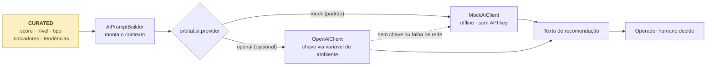

# IA Generativa — Orbital Alert (Fase 5)

## 1. Papel da IA no sistema

A IA generativa do Orbital Alert é **exclusivamente apoio à decisão**. Ela recebe um contexto
já consolidado pela camada CURATED do Data Lake e devolve um texto de recomendação para a
equipe de resposta.

O que a IA **não** faz:

- não cria, altera nem resolve alertas — isso continua no `AlertService`, por regra de limiar;
- não aciona defesa civil, notificações ou qualquer integração externa;
- não escreve em nenhuma camada do Data Lake nem no banco;
- não calcula o score de risco — o score vem do ETL, é determinístico e auditável.

A recomendação é gerada sob demanda e não é persistida. A decisão e a ação são sempre humanas.



## 2. Dois modos de operação

| | **MOCK** (padrão) | **OpenAI** (opcional) |
|---|---|---|
| Ativação | `orbital.ai.provider=mock` ou ausente | `orbital.ai.provider=openai` |
| API key | Não usa | `OPENAI_API_KEY` (variável de ambiente) |
| Rede | Nenhuma chamada | HTTPS para o provedor |
| Determinismo | Totalmente determinístico | Depende do modelo |
| Classe | `MockAiClient.java` | `OpenAiClient.java` |

**Nenhuma chave existe no código ou no repositório.** A propriedade `orbital.ai.api-key` é
preenchida apenas por `${OPENAI_API_KEY:}` — se a variável não existir, o valor é vazio.

Degradação garantida: se `provider=openai` mas a chave estiver ausente, ou se a chamada externa
falhar por qualquer motivo, o `OpenAiClient` cai automaticamente no `MockAiClient` e registra um
`log.warn`. Build, testes e demonstração **nunca dependem de serviço externo**.

Como habilitar o modo real (opcional):

```powershell
$env:OPENAI_API_KEY = "sua-chave"
$env:AI_PROVIDER = "openai"
cd backend
.\mvnw.cmd spring-boot:run "-Dspring-boot.run.profiles=dev"
```

## 3. Contexto enviado à IA

Todo o conteúdo vem da camada CURATED:

| Informação | Origem no CURATED |
|---|---|
| Região | `regionId`, `regionName` |
| Score de risco | `riskScore` |
| Nível de risco | `riskLevel` |
| Tipo de risco | `riskType` |
| Sensor determinante | `dominantSensorType` |
| Sensores relevantes | `indicators[].sensorType` |
| Valores atuais | `indicators[].lastValue` |
| Agregações | `indicators[].avgValue`, `minValue`, `maxValue`, `samples` |
| Tendências | `indicators[].trend` |
| Referência de alerta | `indicators[].threshold` |
| Cobertura | `readings`, `sensors`, `windowStart`, `windowEnd` |

## 4. Instrução de sistema

Constante `AiPromptBuilder.SYSTEM_INSTRUCTION`, enviada ao LLM junto com o contexto:

```text
Voce e um analista de defesa civil do sistema Orbital Alert.
Escreva uma recomendacao objetiva em portugues do Brasil, com no maximo 5 frases,
para a equipe que monitora a regiao descrita.
Regras:
- baseie-se exclusivamente nos dados fornecidos;
- nao invente medicoes, previsoes ou numeros que nao estejam no contexto;
- a recomendacao e apoio a decisao: sugira acoes para operadores humanos,
  nunca afirme que alguma acao ja foi executada automaticamente;
- se o risco for baixo, recomende apenas monitoramento.
```

As restrições existem para reduzir alucinação: o modelo é proibido de inventar medições e de
afirmar que alguma ação já foi tomada.

## 5. Exemplo de prompt

O prompt exato pode ser inspecionado a qualquer momento pelo endpoint de auditoria:

```http
GET /api/recommendations/regions/1/prompt
```

Com os dados de exemplo (região 1, após rodar o ETL):

```text
CONTEXTO DA REGIAO MONITORADA
Regiao: Margem Rio Tiete - Norte (id 1)
Score de risco: 100/100
Nivel de risco: HIGH
Tipo de risco: FLOOD
Sensor dominante: RAINFALL
Leituras consideradas: 6 de 2 sensor(es)
Janela analisada: 2026-09-08T06:00:00Z ate 2026-09-08T08:10:00Z

INDICADORES POR SENSOR
- RAINFALL: atual 70.1 mm/h | media 62.53 | min 55.0 | max 70.1 | limiar de alerta 60.0 | tendencia de risco em elevacao | sub-score 100/100
- WATER_LEVEL: atual 91.2 cm | media 84.83 | min 78.4 | max 91.2 | limiar de alerta 80.0 | tendencia de risco em elevacao | sub-score 100/100

PERGUNTA
Qual a recomendacao de acao para a equipe de resposta desta regiao?
```

> Observação: `regionName` na resposta vem do banco operacional quando difere do arquivo de
> referência — o cadastro do sistema prevalece sobre `data-lake/samples/regions.json`.

## 6. Exemplo de recomendação

```http
GET /api/recommendations/regions/1
```

```json
{
  "regionId": 1,
  "regionName": "Margem Rio Tiete - Norte",
  "riskScore": 100,
  "riskLevel": "HIGH",
  "riskType": "FLOOD",
  "recommendation": "Risco ALTO em Margem Rio Tiete - Norte: score 100/100 com indicacao de risco hidrologico (enchente). O indicador determinante e RAINFALL, com leitura atual de 70.1 mm/h e media de 62.53 frente ao limiar de alerta de 60.0, tendencia de elevacao do risco. Acoes sugeridas: acionar a defesa civil, comunicar moradores das areas ribeirinhas, avaliar rotas de evacuacao e ampliar a frequencia de leitura dos sensores de nivel e chuva. Esta recomendacao e apoio a decisao: a execucao das acoes cabe a equipe responsavel.",
  "generatedAt": "2026-09-08T14:05:12.481",
  "aiMode": "MOCK",
  "dataSource": "CURATED_LAYER",
  "context": {
    "regionId": 1,
    "riskScore": 100,
    "riskLevel": "HIGH",
    "riskType": "FLOOD",
    "dominantSensorType": "RAINFALL",
    "readings": 6,
    "sensors": 2,
    "windowStart": "2026-09-08T06:00:00Z",
    "windowEnd": "2026-09-08T08:10:00Z",
    "indicators": [
      {
        "sensorType": "RAINFALL", "unit": "mm/h", "samples": 3,
        "avgValue": 62.53, "minValue": 55.0, "maxValue": 70.1, "lastValue": 70.1,
        "baseline": 0.0, "threshold": 60.0, "direction": "above",
        "riskType": "FLOOD", "subScore": 100, "trend": "RISING"
      },
      {
        "sensorType": "WATER_LEVEL", "unit": "cm", "samples": 3,
        "avgValue": 84.83, "minValue": 78.4, "maxValue": 91.2, "lastValue": 91.2,
        "baseline": 20.0, "threshold": 80.0, "direction": "above",
        "riskType": "FLOOD", "subScore": 100, "trend": "RISING"
      }
    ],
    "ignoredSensorTypes": [],
    "generatedAt": "2026-09-08T13:51:44Z"
  }
}
```

O campo `context` é a **prova de que a IA consumiu o Data Lake**: ele contém exatamente o
registro lido de `data-lake/curated/region_risk_latest.json`.

### Exemplo de risco baixo (região 4)

```json
{
  "regionId": 4,
  "riskScore": 14,
  "riskLevel": "LOW",
  "riskType": "NONE",
  "recommendation": "Risco BAIXO em Area de Preservacao Leste: score 14/100, sem evidencia de evento critico em formacao. O indicador determinante e RAINFALL, com leitura atual de 1.2 mm/h e media de 2.23 frente ao limiar de alerta de 60.0, tendencia de elevacao do risco. Acao sugerida: manter o monitoramento de rotina, sem necessidade de mobilizacao adicional. Esta recomendacao e apoio a decisao: a execucao das acoes cabe a equipe responsavel.",
  "aiMode": "MOCK",
  "dataSource": "CURATED_LAYER"
}
```

## 7. Como o modo MOCK compõe o texto

O `MockAiClient` monta quatro blocos a partir do mesmo contexto CURATED:

| Bloco | Origem |
|---|---|
| Abertura | `riskLevel` + `riskScore` + `riskType` traduzido |
| Evidência | Indicador dominante: `lastValue`, `unit`, `avgValue`, `threshold`, `trend` |
| Ações | Tabela fixa por (`riskLevel`, `riskType`) |
| Ressalva | Frase fixa lembrando que a execução cabe à equipe |

Não há aleatoriedade: o mesmo CURATED sempre produz o mesmo texto. Isso torna a demonstração
reprodutível e permite usar o modo MOCK como referência ao comparar com o LLM real.

## 8. Endpoints

| Método | Rota | Descrição |
|---|---|---|
| `GET` | `/api/recommendations/regions/{regionId}` | Recomendação de uma região |
| `GET` | `/api/recommendations` | Recomendação de todas as regiões cadastradas |
| `GET` | `/api/recommendations/regions/{regionId}/prompt` | Prompt exato enviado à IA (auditoria) |

Todos são somente leitura. Disponíveis também no Swagger:
`http://localhost:8080/swagger-ui/index.html`.

## 9. Interpretação do campo `dataSource`

| Valor | Significado |
|---|---|
| `CURATED_LAYER` | O ETL foi executado; a IA consumiu a camada Gold do Data Lake |
| `OPERATIONAL_DB_FALLBACK` | O ETL ainda não rodou; o contexto foi agregado direto do banco |

Chamar o endpoint **antes** e **depois** de rodar o ETL é a forma mais direta de evidenciar o
fluxo RAW → TRUSTED → CURATED → IA em uma apresentação: o mesmo endpoint muda de
`OPERATIONAL_DB_FALLBACK` para `CURATED_LAYER`.

O fallback existe para que o endpoint nunca fique inutilizável, e usa
`RiskScoreCalculator.java`, que replica as mesmas regras de `trusted_to_curated.py`.

## 10. Limitações

- No modo MOCK, o texto vem de um gerador por template — é determinístico e limitado ao
  vocabulário previsto no código. Não é um modelo de linguagem.
- No modo OpenAI, a qualidade depende do modelo, e o texto pode variar entre chamadas.
- A IA não valida se a recomendação é operacionalmente viável na região.
- O contexto cobre apenas a janela presente no CURATED — não há memória histórica entre execuções.
