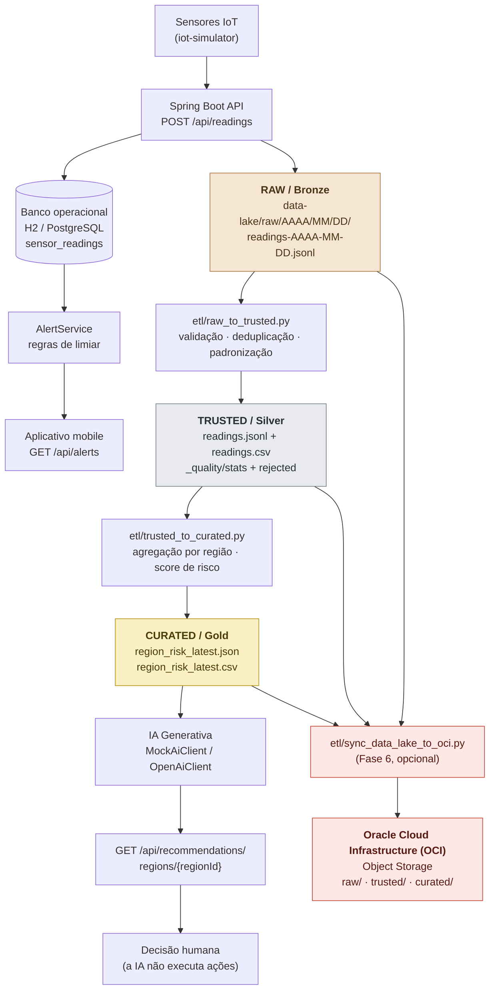

# Arquitetura do Data Lake — Orbital Alert (Fase 5)

## 1. Objetivo

A Fase 5 acrescenta ao Orbital Alert uma camada analítica em cima do que já existia.
O sistema operacional (API + banco + alertas) continua funcionando exatamente como antes.
Em paralelo, cada leitura recebida passa a ser guardada em um **Data Lake de três camadas**,
que alimenta um ETL e, no final, uma **IA generativa de apoio à decisão**.

Princípio central: **o Data Lake nunca substitui o banco operacional**. Ele é um caminho
paralelo. Se o Data Lake falhar, a API, os alertas e o aplicativo mobile continuam funcionando.

## 2. Visão geral



A partir da **Fase 6**, as três camadas também podem ser persistidas no
**OCI Object Storage**, preservando os mesmos prefixes `raw/`, `trusted/` e
`curated/`. O filesystem local continua sendo a fonte de desenvolvimento, teste
e fallback — a sincronização é opcional e explícita. Detalhes em
[oracle-integration.md](oracle-integration.md).

## 3. As três camadas

### 3.1 RAW / Bronze — `data-lake/raw/`

**Função:** guardar o evento **exatamente como chegou**, sem nenhuma transformação.

| Item | Definição |
|---|---|
| Quem escreve | `DataLakeService.java` (backend), a cada `POST /api/readings` |
| Formato | JSON Lines (`.jsonl`) — um evento por linha, append-only |
| Particionamento | Por data de recebimento: `data-lake/raw/2026/09/08/readings-2026-09-08.jsonl` |
| Mutabilidade | Imutável. Nunca é editado nem corrigido |
| Qualidade | Nenhuma garantia. Pode conter duplicatas, campos nulos e valores absurdos |

Campos de um evento RAW:

```json
{
  "eventId": "a1f0c001-0001-4000-8000-000000000003",
  "sensorId": 2,
  "regionId": 1,
  "sensorType": "WATER_LEVEL",
  "value": 91.2,
  "unit": "cm",
  "measuredAt": "2026-09-08T08:00:00",
  "receivedAt": "2026-09-08T08:00:01",
  "source": "IOT_SIMULATOR"
}
```

`eventId` é gerado pela API (UUID) e é a chave de rastreabilidade que segue o dado até o final
do pipeline.

**Por que particionar por data?** Permite reprocessar apenas um dia
(`python etl/raw_to_trusted.py --date 2026-09-08`), aplicar retenção por período e evitar
que um único arquivo cresça indefinidamente.

### 3.2 TRUSTED / Silver — `data-lake/trusted/`

**Função:** o mesmo dado do RAW, porém **confiável**: validado, deduplicado e padronizado.

| Item | Definição |
|---|---|
| Quem escreve | `etl/raw_to_trusted.py` |
| Formato | `readings.jsonl` e `readings.csv` (mesmo conteúdo, dois formatos) |
| Garantias | Sem duplicatas, sem campos obrigatórios nulos, timestamps em UTC ISO-8601, tipos de sensor padronizados |
| Rastreabilidade | Cada linha guarda `event_id`, `source_file` e `ingested_at` |

Registro TRUSTED (nomes em `snake_case`, convenção analítica):

```json
{"event_id": "a1f0c001-0001-4000-8000-000000000001", "sensor_id": 2, "region_id": 1,
 "sensor_type": "WATER_LEVEL", "value": 78.4, "unit": "cm",
 "measured_at": "2026-09-08T06:00:00Z", "received_at": "2026-09-08T06:00:02Z",
 "source": "IOT_SIMULATOR", "source_file": "data-lake/samples/raw_sample.jsonl",
 "ingested_at": "2026-09-08T13:50:58Z"}
```

Além dos dados, a camada guarda o resultado do controle de qualidade em
`data-lake/trusted/_quality/` — detalhado em [data-maintenance.md](data-maintenance.md).

### 3.3 CURATED / Gold — `data-lake/curated/`

**Função:** dado pronto para consumo — agregado por região, com indicadores e score de risco.
É a camada que alimenta analytics e a IA generativa.

| Item | Definição |
|---|---|
| Quem escreve | `etl/trusted_to_curated.py` |
| Granularidade | Uma linha por região (e uma linha por região+sensor nos indicadores) |
| Arquivos | `region_risk_latest.json`, `region_risk_latest.csv`, `indicators_latest.csv`, `region_risk_AAAA-MM-DD.json` |
| Quem lê | `CuratedDataService.java` → `RecommendationService.java` → IA |

## 4. Modelo de risco (CURATED)

O score é **determinístico e sem machine learning** — a escolha é intencional: o objetivo
acadêmico é demonstrar arquitetura de dados, e um cálculo auditável pode ser conferido à mão
durante a apresentação.

### 4.1 Sub-score por tipo de sensor

Cada tipo de sensor tem um valor **normal** (`baseline`, vale 0 pontos) e um **limiar de alerta**
(`limit`, vale 100 pontos). Os limiares são os mesmos do `AlertService` do backend, para que o
Data Lake e o motor operacional de alertas contem a mesma história.

```
sub_score = 100 × (média − baseline) / (limiar − baseline)     → cortado em 0..100
```

| Sensor | baseline | limiar | Direção | Tipo de risco |
|---|---|---|---|---|
| `WATER_LEVEL` | 20 cm | 80 cm | acima | FLOOD |
| `RAINFALL` | 0 mm/h | 60 mm/h | acima | FLOOD |
| `TEMPERATURE` | 25 °C | 40 °C | acima | FIRE |
| `SMOKE` | 10 ppm | 70 ppm | acima | FIRE |
| `HUMIDITY` | 60 % | 30 % | **abaixo** | FIRE |

Umidade é um risco invertido: quanto mais seco, maior o risco. A mesma fórmula funciona porque
`limiar − baseline` fica negativo.

### 4.2 Score da região

```
score = 0.7 × maior(sub_scores) + 0.3 × média(sub_scores) + bônus
bônus = 10 se o indicador dominante estiver com o risco em elevação, senão 0
```

O peso maior no indicador dominante evita que um sensor tranquilo "dilua" um sensor crítico.
A média entra com peso menor para que uma região com vários sinais ruins pontue mais que uma
região com um sinal ruim isolado.

### 4.3 Classificação

| Score | Nível |
|---|---|
| ≥ 70 | `HIGH` |
| 40–69 | `MEDIUM` |
| < 40 | `LOW` (e `riskType` = `NONE`) |

`riskType` vem do indicador dominante: `FLOOD` ou `FIRE`.

### 4.4 Exemplo conferível à mão

Região 2 (Serra da Mantiqueira), a partir dos dados de exemplo:

| Sensor | Leituras | Média | Cálculo do sub-score | Sub-score |
|---|---|---|---|---|
| `TEMPERATURE` | 31.2 / 33.7 / 34.9 | 33.27 | 100 × (33.27 − 25) / (40 − 25) | **55** |
| `HUMIDITY` | 55.0 / 48.3 / 44.1 | 49.13 | 100 × (49.13 − 60) / (30 − 60) | **36** |

```
score = 0.7 × 55 + 0.3 × 45.5 + 10 (temperatura em elevação)
      = 38.5 + 13.65 + 10 = 62.15 → 62  → MEDIUM / FIRE
```

## 5. Estrutura de diretórios

```text
data-lake/
├── raw/                                RAW / Bronze — escrito pela API
│   └── 2026/09/08/
│       └── readings-2026-09-08.jsonl
├── trusted/                            TRUSTED / Silver — escrito pelo ETL
│   ├── readings.jsonl
│   ├── readings.csv
│   ├── _stats_latest.json
│   └── _quality/
│       ├── stats_<runId>.json
│       └── rejected_<runId>.jsonl
├── curated/                            CURATED / Gold — escrito pelo ETL
│   ├── region_risk_latest.json
│   ├── region_risk_latest.csv
│   ├── indicators_latest.csv
│   ├── region_risk_2026-09-08.json
│   └── _stats_latest.json
└── samples/                            Dados de exemplo para demonstração
    ├── raw_sample.jsonl
    ├── regions.json
    └── README.md
```

## 6. Configuração

Nenhum caminho é fixo no código. O backend resolve a raiz do Data Lake por configuração:

| Propriedade | Variável de ambiente | Padrão |
|---|---|---|
| `orbital.datalake.base-path` | `DATA_LAKE_PATH` | `../data-lake` |
| `orbital.datalake.enabled` | `DATA_LAKE_ENABLED` | `true` |

Sendo relativo, `DataLakeService` testa os candidatos usuais (`../data-lake`, `data-lake`), de
modo que funciona tanto rodando de `backend/` (`mvnw spring-boot:run`) quanto da raiz do
repositório (`java -jar`). Um caminho absoluto também é aceito.

## 7. Documentos relacionados

- [ingestion-flow.md](ingestion-flow.md) — como o dado entra e percorre as camadas
- [data-maintenance.md](data-maintenance.md) — qualidade, duplicidade, dados ausentes, retenção
- [ai-generative-example.md](ai-generative-example.md) — prompt e recomendação da IA
