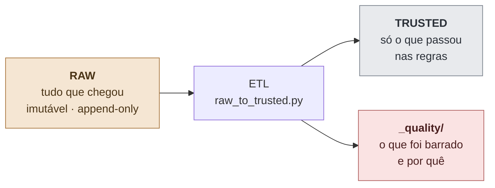
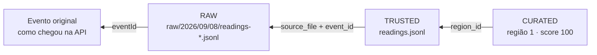

# Qualidade e Manutenção dos Dados — Orbital Alert (Fase 5)

Este documento descreve como o Data Lake trata dados ruins, como garante rastreabilidade e
como é mantido ao longo do tempo.

## 1. Princípio: RAW é imutável, TRUSTED é confiável



Um registro ruim **nunca é apagado nem corrigido no RAW**. Ele é simplesmente barrado na
promoção para TRUSTED, e a cópia integral do registro é preservada em
`data-lake/trusted/_quality/rejected_<runId>.jsonl` com o motivo. Isso permite auditar depois
por que um dado não apareceu na análise.

## 2. Validação

### 2.1 Campos obrigatórios

| Campo | Obrigatório | Motivo da rejeição |
|---|---|---|
| `sensorId` | sim | `missing_sensor_id` |
| `value` | sim | `missing_value` |
| `measuredAt` | sim | `missing_measured_at` |
| `regionId` | não | Aceito nulo; a leitura fica no TRUSTED mas não entra em nenhuma agregação por região |
| `sensorType` | não | Aceito ausente; vira `UNKNOWN` e não recebe regra de risco |
| `unit` | não | Preenchido pelo padrão do tipo de sensor |
| `source` | não | Vira `UNKNOWN` |

### 2.2 Validação de tipo e faixa

| Regra | Motivo da rejeição |
|---|---|
| `sensorId` conversível para inteiro | `invalid_sensor_id` |
| `regionId` conversível para inteiro (quando presente) | `invalid_region_id` |
| `value` conversível para número e não-`NaN` | `invalid_value` |
| `-100 ≤ value ≤ 10000` | `value_out_of_range` |
| `measuredAt` em formato ISO reconhecível | `invalid_measured_at` |
| Linha é um JSON válido | `unparseable_line` |
| Linha é um objeto JSON (não lista/número) | `not_an_object` |

A faixa `-100 a 10000` é uma barreira de sanidade genérica contra leituras corrompidas de
sensor. Não é uma faixa por tipo de sensor: manter uma regra única e larga é suficiente para o
MVP e evita descartar por engano leituras extremas legítimas — que são justamente as que
interessam ao sistema de alertas.

## 3. Padronização

| Aspecto | Regra |
|---|---|
| **Timestamps** | Convertidos para UTC ISO-8601 com sufixo `Z` (`2026-09-08T06:00:00Z`) |
| **Timestamp sem fuso** | O backend grava `LocalDateTime` (sem fuso). O ETL **assume UTC**. Regra única e explícita, para que a comparação entre leituras seja sempre consistente |
| **Tipo de sensor** | Normalizado em maiúsculas e por tabela de sinônimos |
| **`RAIN` → `RAINFALL`** | `database/schema.sql` usava `RAIN` e o enum Java usa `RAINFALL`. O ETL reconcilia os dois no TRUSTED, sem exigir mudança no banco nem no código existente |
| **Unidade ausente** | `WATER_LEVEL`→`cm`, `RAINFALL`→`mm/h`, `TEMPERATURE`→`C`, `SMOKE`→`ppm`, `HUMIDITY`→`%` |
| **Valores numéricos** | Arredondados em 4 casas |
| **Nomenclatura** | RAW usa `camelCase` (espelha o Java); TRUSTED/CURATED usam `snake_case` (convenção analítica) |

## 4. Duplicidade

Duplicatas acontecem por retentativa do sensor, reenvio do simulador ou reprocessamento do
mesmo arquivo RAW. São tratadas em dois níveis:

| Nível | Chave | Motivo registrado | Caso típico |
|---|---|---|---|
| **Técnico** | `eventId` | `duplicate_event_id` | O mesmo evento foi gravado duas vezes no RAW |
| **Negócio** | `sensorId` + `measuredAt` + `value` | `duplicate_business_key` | O sensor reenviou a leitura e a API gerou um novo `eventId` |

A política é **manter a primeira ocorrência** e descartar as seguintes. Como a leitura do RAW é
ordenada por caminho de arquivo, a primeira ocorrência é a cronologicamente mais antiga.

O nível de negócio é o que realmente protege as agregações: sem ele, uma retentativa do
simulador contaria duas vezes no cálculo da média e inflaria o score de risco da região.

## 5. Dados ausentes

| Situação | Tratamento | Justificativa |
|---|---|---|
| Campo obrigatório nulo | Registro rejeitado, cópia preservada em `_quality/` | Sem `value` ou `measuredAt` a leitura não tem uso analítico |
| `regionId` nulo | Registro aceito no TRUSTED, contado em `events_without_region` no CURATED | O dado é válido, apenas não agregável por região |
| `unit` ausente | Preenchido pelo padrão do tipo | Valor derivável com segurança |
| `sensorType` sem regra de risco (ex.: `PRESSURE`) | Fica no TRUSTED; listado em `ignoredSensorTypes` no CURATED | Não é um erro — é um sensor sem modelo de risco definido ainda |
| Região sem nenhuma leitura | Não aparece no CURATED; o endpoint cai no fallback do banco | Ausência de dado não é risco zero, é ausência de informação |

**Nenhum valor ausente é imputado.** Não há preenchimento por média, último valor ou
interpolação. Inventar leitura de sensor em um sistema de alerta de desastre produziria risco
falso — preferimos uma região com menos amostras a uma região com amostras fabricadas.

## 6. Rastreabilidade

Cada registro TRUSTED carrega a sua própria procedência:

| Campo | Significado |
|---|---|
| `event_id` | UUID gerado pela API no momento do recebimento — segue o dado por todo o pipeline |
| `source` | Origem declarada pelo emissor (`IOT_SIMULATOR`, `API`, …) |
| `source_file` | Arquivo RAW exato de onde a linha veio |
| `received_at` | Quando a API recebeu |
| `measured_at` | Quando o sensor mediu |
| `ingested_at` | Quando o ETL promoveu para TRUSTED |

Com isso é possível partir de um score de risco no CURATED e voltar até a linha original no
arquivo RAW:



Além disso, cada execução gera um `runId` (timestamp UTC) que nomeia os arquivos de estatísticas
e de rejeitados, permitindo comparar execuções.

## 7. Estatísticas de processamento

`etl/raw_to_trusted.py` grava `_quality/stats_<runId>.json` (e uma cópia em
`_stats_latest.json`) com:

```json
{
  "layer": "TRUSTED",
  "run_id": "20260908T135058Z",
  "files_read": 1,
  "records_read": 28,
  "records_valid": 22,
  "records_rejected": 6,
  "duplicates_technical": 1,
  "duplicates_business": 1,
  "acceptance_rate_pct": 78.57,
  "rejected_by_reason": {
    "duplicate_event_id": 1,
    "duplicate_business_key": 1,
    "missing_value": 1,
    "invalid_measured_at": 1,
    "missing_sensor_id": 1,
    "value_out_of_range": 1
  },
  "records_by_sensor_type": { "WATER_LEVEL": 3, "RAINFALL": 6, "TEMPERATURE": 6, "SMOKE": 3, "HUMIDITY": 3, "PRESSURE": 1 },
  "records_by_region": { "1": 6, "2": 6, "3": 6, "4": 4 }
}
```

`acceptance_rate_pct` é o indicador de saúde da ingestão. Uma queda brusca costuma indicar
sensor com defeito, mudança de contrato no payload ou reprocessamento acidental do mesmo RAW.

`etl/trusted_to_curated.py` grava `curated/_stats_latest.json` com as regras de score
efetivamente usadas na execução, o que torna cada snapshot autoexplicativo.

## 8. Manutenção

### 8.1 Reprocessamento

O ETL é **idempotente**: reexecutar sobre o mesmo RAW produz exatamente o mesmo TRUSTED, porque
a deduplicação é feita dentro da própria execução e os arquivos de saída são reescritos, não
acrescidos.

```powershell
# Reprocessa apenas um dia
python etl/raw_to_trusted.py --date 2026-09-08

# Reprocessa tudo
python etl/raw_to_trusted.py
python etl/trusted_to_curated.py
```

Se uma regra de qualidade mudar, basta reexecutar sobre o RAW — que nunca foi alterado — para
reconstruir TRUSTED e CURATED. Essa é a principal razão de manter o RAW imutável.

### 8.2 Retenção sugerida

| Camada | Retenção | Racional |
|---|---|---|
| RAW | 12 meses, particionado por dia | Permite reprocessar o histórico se as regras mudarem |
| TRUSTED | Reconstruível a partir do RAW | Pode ser regenerado a qualquer momento |
| CURATED | Snapshots diários (`region_risk_AAAA-MM-DD.json`) | Permite acompanhar a evolução do risco por região |
| `_quality/` | Mesma retenção do RAW | É a evidência de auditoria da ingestão |

Como o particionamento do RAW é por data, aplicar retenção é remover diretórios de anos/meses
antigos — sem varredura nem consulta.

### 8.3 Evolução de esquema

Campos novos no evento RAW não quebram o ETL: campos desconhecidos são ignorados na validação
e o `RegionRisk` do backend usa `@JsonIgnoreProperties(ignoreUnknown = true)`. Para que um campo
novo chegue ao TRUSTED, basta acrescentá-lo em `validate()` e em `CSV_COLUMNS`.

Para acrescentar um novo tipo de sensor ao modelo de risco, é preciso alterar **dois** pontos,
que devem permanecer sincronizados:

1. `RISK_RULES` em `etl/trusted_to_curated.py`;
2. `RULES` em `backend/.../service/RiskScoreCalculator.java` (usado no fallback).

### 8.4 Checklist de operação

- [ ] `acceptance_rate_pct` está próximo do histórico?
- [ ] `rejected_by_reason` tem algum motivo novo ou em crescimento?
- [ ] `duplicates_business` subiu? (indica sensor retransmitindo)
- [ ] `events_without_region` é zero?
- [ ] Alguma região sumiu do `region_risk_latest.json`? (sensor parado)
- [ ] `ignoredSensorTypes` tem algum tipo que já deveria ter regra de risco?

## 9. O que este MVP não faz

Registrado explicitamente para não gerar expectativa incorreta na avaliação:

- não há orquestrador (Airflow, cron): o ETL é executado manualmente;
- não há catálogo de dados nem controle de versão de esquema;
- não há particionamento no TRUSTED/CURATED — os arquivos são reescritos por completo;
- não há controle de acesso por camada;
- não há detecção estatística de anomalia (z-score, desvio-padrão): apenas faixa fixa.

São limitações conscientes de um MVP acadêmico focado em demonstrar a **arquitetura** de um
Data Lake em três camadas.
