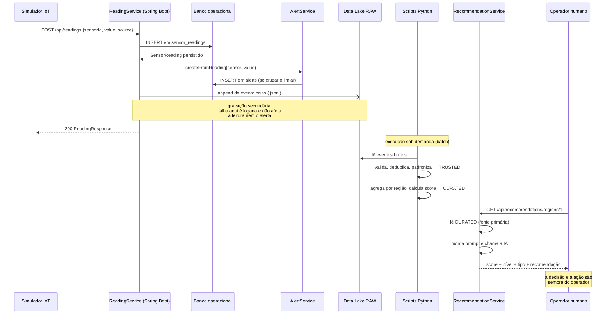
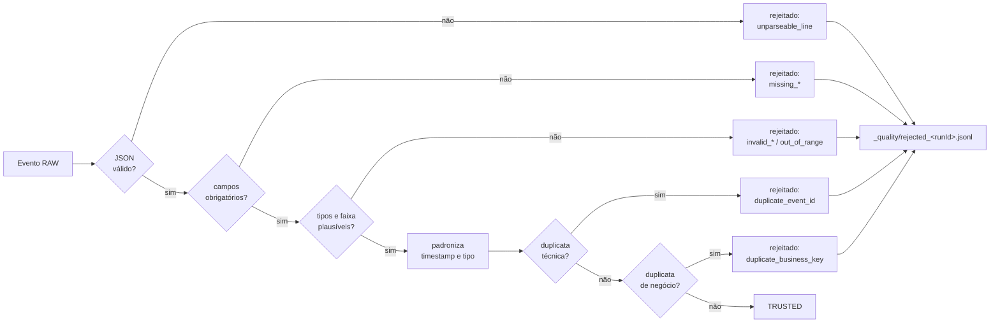
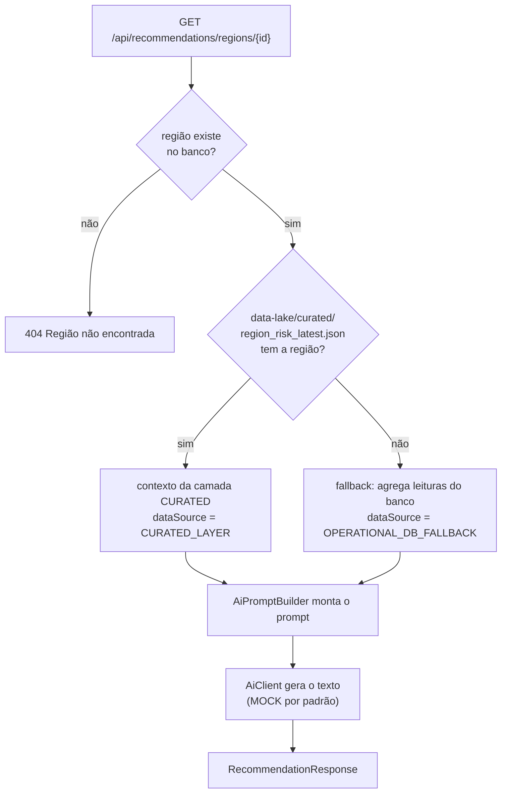

# Fluxo de Ingestão — Orbital Alert (Fase 5)

Este documento descreve o caminho completo de um dado, do sensor até a recomendação da IA.

## 1. Visão em sequência



## 2. Etapa 1 — Sensor → API

O simulador envia uma leitura:

```powershell
python iot-simulator/sensor_simulator.py --sensor-id 2 --value 91.2
```

Payload:

```json
{ "sensorId": 2, "value": 91.2, "source": "IOT_SIMULATOR" }
```

O campo `source` é **opcional**. Payloads antigos (só `sensorId` e `value`) continuam válidos —
nesse caso o backend registra `source: "API"`. Isso preserva a compatibilidade com o que já
existia antes da Fase 5.

## 3. Etapa 2 — API → banco operacional (comportamento preservado)

`ReadingService.create()` mantém a ordem original de operações:

1. busca o sensor (404 se não existir);
2. persiste a `SensorReading`;
3. chama `AlertService.createFromReading()`, que abre um `Alert` se o valor cruzar o limiar.

Nada disso mudou na Fase 5.

## 4. Etapa 3 — API → RAW (novo, em paralelo)

Depois de salvar no banco e gerar o alerta, o `ReadingService` grava o evento bruto:

```java
// Data Lake em paralelo ao banco operacional: falha aqui não afeta leitura nem alerta.
dataLake.writeRawEvent(new RawEventDto(UUID.randomUUID().toString(), s.getId(),
    s.getRegion().getId(), s.getType().name(), req.value(), s.getUnit(),
    sr.getMeasuredAt(), now, req.source() == null ? "API" : req.source()));
```

Garantias de segurança do fluxo:

| Situação | Comportamento |
|---|---|
| Disco cheio, permissão negada, caminho inválido | `DataLakeService` captura, registra `log.warn` e retorna. A resposta HTTP continua 200 |
| `orbital.datalake.enabled=false` | A gravação é ignorada silenciosamente. O restante do sistema não muda |
| Diretório ainda não existe | É criado sob demanda (`Files.createDirectories`) |

Arquivo resultante, particionado por data de recebimento:

```text
data-lake/raw/2026/09/08/readings-2026-09-08.jsonl
```

Formato **JSON Lines com append**: uma linha por evento. Escolhido porque a escrita é atômica
por linha, não exige reler nem reescrever o arquivo, e é trivial de processar em streaming.

## 5. Etapa 4 — RAW → TRUSTED

```powershell
python etl/raw_to_trusted.py
```

O script varre recursivamente as partições de `data-lake/raw/` e aplica, nesta ordem:



Regras aplicadas — o detalhamento está em [data-maintenance.md](data-maintenance.md):

| Regra | Descrição |
|---|---|
| Campos obrigatórios | `sensorId`, `value`, `measuredAt` |
| Faixa plausível | `-100 ≤ value ≤ 10000` |
| Timestamp | Padronizado para UTC ISO-8601 (`2026-09-08T06:00:00Z`) |
| Tipo de sensor | `RAIN` → `RAINFALL` (o schema SQL e o enum Java usavam nomes diferentes) |
| Unidade ausente | Preenchida pelo padrão do tipo (`WATER_LEVEL` → `cm`) |
| Duplicata técnica | Mesmo `eventId` |
| Duplicata de negócio | Mesmo `sensorId` + `measuredAt` + `value` |

Saída: `readings.jsonl`, `readings.csv` e as estatísticas em `_quality/`.

## 6. Etapa 5 — TRUSTED → CURATED

```powershell
python etl/trusted_to_curated.py
```

1. agrupa as leituras por `region_id`;
2. para cada tipo de sensor da região, calcula `samples`, `avg`, `min`, `max`, `last` e a tendência;
3. converte cada média em um sub-score 0–100 comparando com o limiar de alerta do backend;
4. combina os sub-scores no score final da região e classifica em `LOW` / `MEDIUM` / `HIGH`;
5. grava JSON (para a IA) e CSV (para analytics).

A fórmula completa está em [data-lake-architecture.md](data-lake-architecture.md#4-modelo-de-risco-curated).

Resultado com os dados de exemplo:

| ID | Região | Score | Nível | Tipo |
|---|---|---|---|---|
| 1 | Margem Rio Tietê - Norte | 100 | HIGH | FLOOD |
| 3 | Zona Rural Oeste | 100 | HIGH | FIRE |
| 2 | Serra da Mantiqueira - Sul | 62 | MEDIUM | FIRE |
| 4 | Área de Preservação Leste | 14 | LOW | NONE |

## 7. Etapa 6 — CURATED → IA → recomendação

```http
GET /api/recommendations/regions/1
```

`RecommendationService` resolve o contexto **priorizando o Data Lake**:



O campo `dataSource` da resposta torna explícito **de qual camada veio o dado**, o que permite
demonstrar na banca a diferença entre rodar o endpoint antes e depois do ETL:

| `dataSource` | Significado |
|---|---|
| `CURATED_LAYER` | O ETL foi executado e a IA consumiu a camada Gold do Data Lake |
| `OPERATIONAL_DB_FALLBACK` | O ETL ainda não rodou; o contexto foi agregado direto do banco |

O fallback usa `RiskScoreCalculator.java`, que replica exatamente as regras de
`trusted_to_curated.py` — o mesmo cenário produz o mesmo score nos dois caminhos.

## 8. Onde o dado fica em cada etapa

| Etapa | Artefato | Origem |
|---|---|---|
| Operacional | tabela `sensor_readings`, tabela `alerts` | `ReadingService`, `AlertService` |
| RAW | `data-lake/raw/AAAA/MM/DD/readings-*.jsonl` | `DataLakeService` |
| TRUSTED | `data-lake/trusted/readings.{jsonl,csv}` | `etl/raw_to_trusted.py` |
| Qualidade | `data-lake/trusted/_quality/` | `etl/raw_to_trusted.py` |
| CURATED | `data-lake/curated/region_risk_latest.*` | `etl/trusted_to_curated.py` |
| Recomendação | resposta HTTP (não é persistida) | `RecommendationService` |

A recomendação é gerada sob demanda e **não é gravada em lugar nenhum** — é apoio à decisão,
não um registro do sistema.
