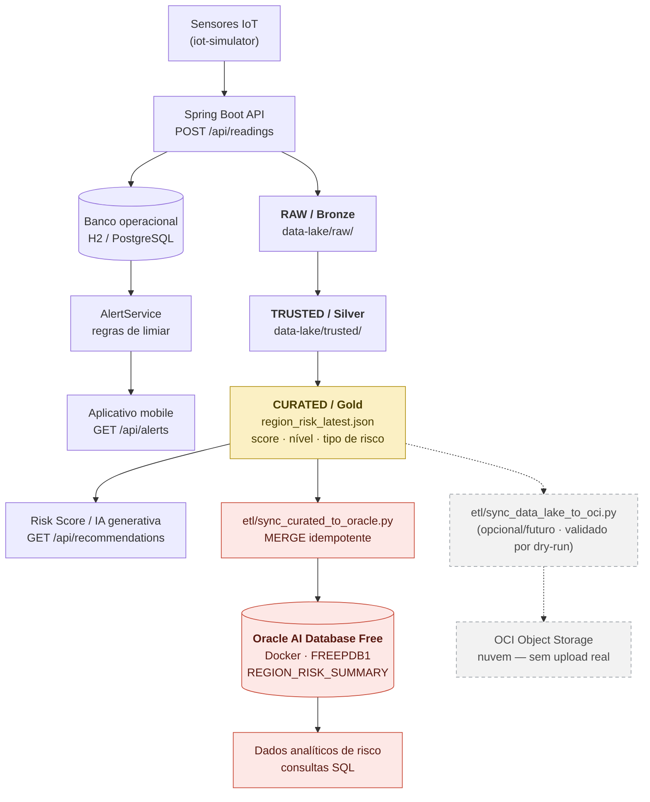

# Integração Oracle — Oracle AI Database Free (Fase 6)

> Esta é a **evidência principal de integração Oracle do projeto**: um banco de dados
> Oracle real, rodando localmente em Docker, recebendo os dados analíticos da camada
> CURATED do Data Lake.
>
> A integração com **OCI Object Storage** continua no repositório e permanece
> documentada em [oracle-integration.md](oracle-integration.md) como **opção de nuvem
> opcional/futura, implementada em código e validada por dry-run** — não houve upload
> real para a nuvem.

## 1. Tecnologia escolhida

**Oracle AI Database Free** (antes *Oracle Database Free* / *XE*), executado localmente
em contêiner Docker a partir da imagem oficial da Oracle:

```
container-registry.oracle.com/database/free:latest-lite
```

Versão efetivamente rodando neste projeto:

```
Oracle AI Database 26ai Free Release 23.26.3.0.0 - Develop, Learn, and Run for Free
```

Acesso pelo **driver oficial Python da Oracle**, `oracledb`, em modo *thin* — que não
exige Oracle Instant Client instalado na máquina.

A variante `-lite` é a imagem enxuta da Oracle: mesmo motor, sem os componentes
opcionais (APEX, ORDS, patches de idioma). Download e inicialização bem mais rápidos,
que é o que interessa para um ambiente reproduzível de MVP acadêmico.

## 2. Papel no projeto — o que o Oracle **não** é aqui

**O Oracle Database não substitui o banco operacional.** H2 (dev) e PostgreSQL (prod)
continuam sendo o banco transacional que atende a API, o `AlertService` e o aplicativo
mobile. Nada disso foi alterado.

O Oracle é uma **persistência analítica adicional**, ligada à ponta do Data Lake:

| Camada | Onde vive | Quem consome |
|---|---|---|
| Banco operacional | H2 / PostgreSQL | API, `AlertService`, mobile |
| RAW → TRUSTED → CURATED | `data-lake/` (arquivos) | ETLs, IA generativa |
| **Analítico Oracle** | **`REGION_RISK_SUMMARY`** | **consultas SQL de risco** |

Se o Oracle estiver desligado, **nada no projeto para de funcionar**: backend, alertas,
ETLs, simulador e mobile seguem iguais. A sincronização é um passo explícito e opcional.

## 3. Motivo da escolha

1. **Integração Oracle real e verificável.** Um banco de pé, com tabela criada e linhas
   consultáveis por SQL, é uma evidência que pode ser reproduzida por qualquer avaliador
   em qualquer máquina com Docker — sem depender de conta em nuvem.
2. **Encaixe natural no pipeline.** A camada CURATED já produz um agregado por região
   (score, nível e tipo de risco). Isso é uma **tabela**: colunas fixas, tipos definidos,
   chave natural. É exatamente o formato que um banco relacional serve melhor que arquivo.
3. **Consulta analítica de verdade.** Sobre arquivo JSON não se faz `GROUP BY`,
   `ORDER BY` nem histórico por janela de tempo sem escrever código. Sobre a tabela
   Oracle, isso é SQL.
4. **Risco zero para o que já funciona.** A carga é um script Python isolado. Não migrou
   banco, não mexeu no backend, no `AlertService`, nos ETLs nem nas regras existentes.

> **Por que não foi usado o OCI como evidência principal:** não foi possível concluir a
> criação da conta Oracle Cloud (erro no cadastro). O código de integração com o OCI
> Object Storage foi mantido, testado e validado em `--dry-run`, e permanece como
> caminho de nuvem para uma fase futura.

## 4. Arquitetura



Fluxo em uma linha:

```
Sensor -> Spring Boot -> H2/PostgreSQL -> AlertService -> Mobile
              |
              +--> RAW -> TRUSTED -> CURATED -> Risk Score / IA
                                        |
                                        +--> Oracle AI Database Free -> análise de risco
```

## 5. A tabela `REGION_RISK_SUMMARY`

O grão é **uma linha por região por execução do ETL** — ou seja, cada snapshot do
CURATED vira um registro histórico. As colunas seguem exatamente os campos que já
existem em `data-lake/curated/region_risk_latest.json`; **nenhum arquivo do CURATED foi
alterado para caber no banco**.

| Coluna | Tipo Oracle | Origem no CURATED |
|---|---|---|
| `REGION_ID` | `NUMBER(10)` **PK** | `regionId` |
| `REGION_NAME` | `VARCHAR2(200)` | `regionName` |
| `RISK_SCORE` | `NUMBER(5)` | `riskScore` |
| `RISK_LEVEL` | `VARCHAR2(20)` | `riskLevel` (`HIGH`/`MEDIUM`/`LOW`) |
| `RISK_TYPE` | `VARCHAR2(30)` | `riskType` (`FLOOD`/`FIRE`) |
| `DOMINANT_SENSOR_TYPE` | `VARCHAR2(30)` | `dominantSensorType` |
| `READINGS` | `NUMBER(10)` | `readings` |
| `SENSORS` | `NUMBER(10)` | `sensors` |
| `INDICATORS` | `NUMBER(10)` | quantidade de itens em `indicators` |
| `WINDOW_START` | `TIMESTAMP` | `windowStart` (UTC) |
| `WINDOW_END` | `TIMESTAMP` | `windowEnd` (UTC) |
| `GENERATED_AT` | `TIMESTAMP` **PK** | `generatedAt` (UTC) |
| `SOURCE` | `VARCHAR2(400)` | caminho do arquivo CURATED lido |
| `INGESTED_AT` | `TIMESTAMP` | `SYSTIMESTAMP` no momento da carga |

**Chave primária `(REGION_ID, GENERATED_AT)`** — é ela que garante a idempotência:

- rodar o **mesmo** snapshot duas vezes **atualiza** a linha, não duplica;
- uma **nova** execução do ETL gera um novo `generatedAt` e vira um **novo registro
  histórico**, permitindo acompanhar a evolução do risco de cada região.

Todos os horários são gravados em **UTC**, como já vinham do Data Lake.

## 6. Conexão e configuração

Tudo vem de variáveis de ambiente. **Nenhuma senha é versionada.**

| Variável | Obrigatória | Padrão |
|---|---|---|
| `ORACLE_DB_HOST` | não | `localhost` |
| `ORACLE_DB_PORT` | não | `1521` |
| `ORACLE_DB_SERVICE` | não | `FREEPDB1` |
| `ORACLE_DB_USER` | não | `ORBITAL_ALERT` |
| `ORACLE_DB_PASSWORD` | **sim** | — |

Os padrões já apontam para o contêiner local, então na prática só a senha precisa ser
informada. Modelo com placeholders em [.env.example](../.env.example).

## 7. Segurança

- **A aplicação nunca usa `SYSTEM`.** Ela se conecta como `ORBITAL_ALERT`, dono do
  próprio schema, com apenas dois privilégios de sistema: `CREATE SESSION` e
  `CREATE TABLE`. `INSERT`/`UPDATE`/`SELECT` nos objetos do próprio schema são
  implícitos do dono — por isso **não** há `GRANT` de `DBA`, `RESOURCE` ou `ANY TABLE`.
- **Nenhuma senha em arquivo versionado.** Nem no código, nem no `.env.example`, nem no
  `database/oracle-setup.sql` (que pede a senha na execução, com `ACCEPT ... HIDE`), nem
  neste documento. O `.env` real está no `.gitignore`.
- **A senha nunca é impressa.** O resumo de configuração do script mostra
  `password: (definida)` — há teste automatizado garantindo isso.
- **Escopo local.** A porta `1521` é publicada apenas em `localhost`. É um banco de
  desenvolvimento; as senhas usadas aqui não valem em nenhum outro ambiente.
- **Bind variables em todo o SQL.** O `MERGE` usa parâmetros nomeados, sem concatenação
  de strings — não há superfície para injeção de SQL.

## 8. Comandos

Se `docker` não estiver no `PATH` (instalação por usuário do Docker Desktop):

```powershell
$env:PATH = "$env:LOCALAPPDATA\Programs\DockerDesktop\resources\bin;$env:PATH"
```

### 8.1. Primeira vez — criar o contêiner

```powershell
docker pull container-registry.oracle.com/database/free:latest-lite

docker volume create orbital-alert-oracle-data

# A senha fica só na sessão do PowerShell; nunca em arquivo versionado.
$sysPwd = Read-Host "Senha do SYSTEM" -AsSecureString
$sysPlain = [Runtime.InteropServices.Marshal]::PtrToStringAuto(
  [Runtime.InteropServices.Marshal]::SecureStringToBSTR($sysPwd))

docker run -d `
  --name orbital-alert-oracle `
  -p 1521:1521 `
  -e ORACLE_PWD=$sysPlain `
  -v orbital-alert-oracle-data:/opt/oracle/oradata `
  container-registry.oracle.com/database/free:latest-lite
```

Acompanhe a inicialização (leva alguns minutos na primeira vez):

```powershell
docker logs -f orbital-alert-oracle
```

Espere pela linha:

```
#########################
DATABASE IS READY TO USE!
#########################
```

### 8.2. Iniciar / parar o contêiner (depois de criado)

```powershell
docker start orbital-alert-oracle
docker stop  orbital-alert-oracle
docker ps --filter "name=orbital-alert-oracle"
```

O volume `orbital-alert-oracle-data` preserva os dados entre `stop` e `start`.

### 8.3. Criar o usuário da aplicação (uma única vez)

```powershell
Get-Content database/oracle-setup.sql | docker exec -i orbital-alert-oracle `
  sqlplus -S "system/<SENHA_SYSTEM>@localhost:1521/FREEPDB1"
```

O script pede a senha do `ORBITAL_ALERT` de forma oculta e cria tablespace, usuário e
os privilégios mínimos.

### 8.4. Sincronizar CURATED → Oracle

```powershell
pip install -r etl/requirements-oracle-db.txt

# Ver o que seria gravado, sem tocar no banco:
python etl/sync_curated_to_oracle.py --dry-run

# Carga real:
$env:ORACLE_DB_PASSWORD = "<senha do ORBITAL_ALERT>"
python etl/sync_curated_to_oracle.py
```

Saída esperada:

```
--- Carga ---
Tabela REGION_RISK_SUMMARY : criada
[ORACLE] Regiao 1 | HIGH | FLOOD | score=100 -> OK

--- Resumo ---
Banco               : localhost:1521/FREEPDB1
Registros gravados  : 1/1
Linhas na tabela    : 1

OK: camada CURATED sincronizada com o Oracle AI Database Free.
```

Rodar o comando de novo com o mesmo CURATED mantém **1 linha** — a prova de que o
`MERGE` é idempotente.

### 8.5. Remover tudo (recomeçar do zero)

```powershell
docker rm -f orbital-alert-oracle
docker volume rm orbital-alert-oracle-data   # apaga os dados
```

## 9. Consulta SQL que prova os registros

```powershell
docker exec -it orbital-alert-oracle sqlplus "ORBITAL_ALERT/<senha>@localhost:1521/FREEPDB1"
```

```sql
-- Em qual container/PDB estamos e com qual usuário
SELECT sys_context('USERENV','CON_NAME') AS container_name, USER AS db_user FROM dual;

-- Quantidade de registros
SELECT COUNT(*) FROM REGION_RISK_SUMMARY;

-- Os dados
SELECT * FROM REGION_RISK_SUMMARY;
```

Resultado obtido neste projeto, com os dados reais da camada CURATED:

```
CONTAINER_NAME  DB_USER
--------------- -------------
FREEPDB1        ORBITAL_ALERT

TOTAL_REGISTROS
---------------
              1

 REGION_ID REGION_NAME                RISK_SCORE RISK_LEVEL RISK_TYP DOMINANT_SEN
---------- -------------------------- ---------- ---------- -------- ------------
         1 Margem Rio Tiete - Norte          100 HIGH       FLOOD    RAINFALL

 REGION_ID   READINGS    SENSORS INDICATORS WINDOW_START        WINDOW_END          GENERATED_AT
---------- ---------- ---------- ---------- ------------------- ------------------- -------------------
         1          6          2          2 2026-09-08 11:53:14 2026-09-08 11:53:16 2026-09-08 17:04:11
```

Consulta analítica de exemplo — regiões em risco alto, da mais crítica para a menos:

```sql
SELECT REGION_ID, REGION_NAME, RISK_TYPE, RISK_SCORE, GENERATED_AT
  FROM REGION_RISK_SUMMARY
 WHERE RISK_LEVEL = 'HIGH'
 ORDER BY RISK_SCORE DESC, GENERATED_AT DESC;
```

## 10. Testes

```powershell
python -m unittest discover -s etl/tests -v
```

`etl/tests/test_oracle_database.py` cobre, **sem exigir banco nenhum**: parsing do
CURATED (JSON e fallback CSV), conversão de timestamps UTC, mapeamento de cada coluna,
validação de configuração, geração dos binds do `MERGE`, criação condicional da tabela e
o comportamento do CLI (incluindo a garantia de que o dry-run não abre conexão e de que a
senha nunca aparece na saída). A conexão real é exercitada separadamente, contra o
contêiner local, pelo comando da seção 8.4.

## 11. Evidências para o trabalho acadêmico

As capturas estão em [`docs/evidencias-oracle-db/`](evidencias-oracle-db/):

| Arquivo | O que comprova |
|---|---|
| `01-docker-container-running.png` | Docker Desktop com o contêiner `orbital-alert-oracle` em execução (porta `1521`), e o log de inicialização com `DATABASE IS READY TO USE!` |
| `02-sqlplus-freepdb1-region-risk-summary.png` | SQL\*Plus conectado com `CON_NAME = FREEPDB1` e `USER = ORBITAL_ALERT`, mostrando `SELECT COUNT(*)` e `SELECT * FROM REGION_RISK_SUMMARY` com os dados reais da camada CURATED |
| `03-sync-curated-to-oracle.png` | Execução do sync com `[ORACLE] Regiao 1 \| HIGH \| FLOOD \| score=100 -> OK`, `Registros gravados: 1/1` e `Linhas na tabela: 1` |

Nenhuma das capturas expõe senha: o resumo de configuração do script mostra apenas
`password : (definida)`.

Para reproduzir, siga a seção 8 e depois a consulta da seção 9. Rodar o sync uma segunda vez
mantém `Linhas na tabela : 1`, o que reforça a idempotência do `MERGE`.
