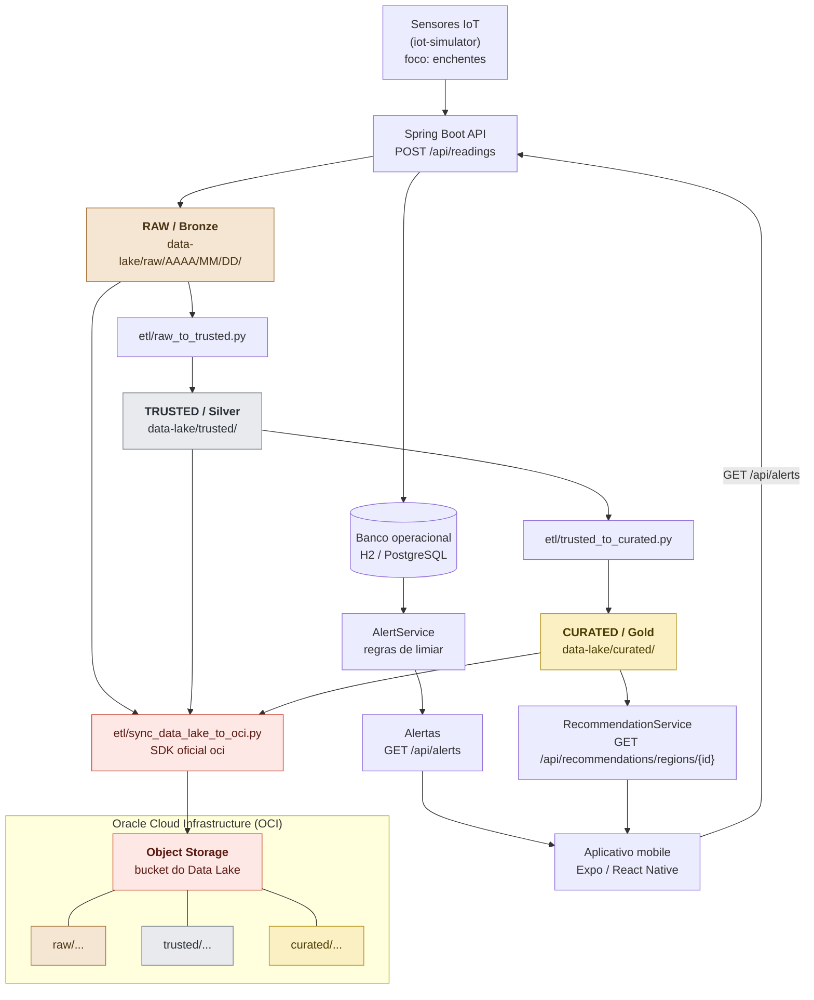

# Integração Oracle — OCI Object Storage (Fase 6)

> **Status: integração de nuvem opcional/futura.**
> Não foi possível concluir a criação da conta Oracle Cloud (erro no cadastro), então
> **nenhum upload real para o OCI foi executado**. A integração permanece implementada
> em código, coberta por 25 testes automatizados e **validada por `--dry-run`** — pronta
> para uma fase futura, assim que houver uma conta disponível.
>
> A **evidência principal de integração Oracle do projeto** é o banco de dados real
> descrito em **[oracle-database-integration.md](oracle-database-integration.md)**:
> um **Oracle AI Database Free** rodando localmente em Docker, recebendo os dados
> analíticos da camada CURATED na tabela `REGION_RISK_SUMMARY`.

## 1. Tecnologia escolhida

**Oracle Cloud Infrastructure (OCI) — Object Storage.**

Serviço gerenciado de armazenamento de objetos da Oracle. Guarda arquivos
(objetos) dentro de *buckets*, endereçados por um nome que pode conter `/` e,
portanto, imitar uma árvore de diretórios (*prefixes*).

Acesso pelo **SDK oficial Python** (`pip install oci`), classe
`oci.object_storage.ObjectStorageClient`, operação `put_object`.

## 2. Papel no projeto

O OCI Object Storage é o **destino em nuvem das três camadas do Data Lake**:

| Camada local | Prefix no bucket |
|---|---|
| `data-lake/raw/**` | `raw/...` |
| `data-lake/trusted/**` | `trusted/...` |
| `data-lake/curated/**` | `curated/...` |

A estrutura relativa é preservada sem tradução:

```
LOCAL  data-lake/raw/2026/09/08/readings-2026-09-08.jsonl
OCI    raw/2026/09/08/readings-2026-09-08.jsonl
```

O que **não** mudou: o banco operacional (H2/PostgreSQL), o `AlertService`, os
ETLs, o endpoint de recomendação e o app mobile continuam exatamente como
estavam. A integração Oracle é um **caminho paralelo de persistência**.

## 3. Motivo da escolha

1. **O formato já combina.** O Data Lake do Orbital Alert nasceu em arquivos
   JSON/JSONL/CSV particionados por data. Object Storage é feito exatamente para
   isso — não foi preciso remodelar nada para caber na tecnologia.
2. **Desacoplamento do banco operacional.** O histórico analítico cresce
   indefinidamente; o banco transacional que atende os alertas não deve crescer
   junto. Object Storage separa os dois ciclos de vida.
3. **Escala e custo do histórico.** O volume de leituras IoT cresce por dia de
   operação. Object Storage escala sem provisionar servidor e oferece políticas
   de retenção/tiering por prefix.
4. **Menor mudança possível.** A integração é um script Python de sincronização.
   Não exigiu migrar banco, adicionar orquestrador nem criar microsserviço.

Alternativas descartadas de propósito: migrar para Oracle Database (trocaria uma
peça que já funciona), Oracle Generative AI (a IA já tem mock + OpenAI opcional)
e Terraform/Kubernetes (complexidade sem ganho para um MVP acadêmico).

## 4. Arquitetura



## 5. Ambiente local vs. ambiente cloud

| | Local | Cloud |
|---|---|---|
| Onde os dados ficam | filesystem, pasta `data-lake/` | bucket OCI Object Storage |
| Quem escreve | `DataLakeService.java` e os ETLs | `etl/sync_data_lake_to_oci.py` |
| Precisa de internet | não | sim |
| Precisa de conta Oracle | não | sim |
| Papel | desenvolvimento, testes, demonstração e **fallback** | persistência histórica e escalabilidade |

**Regra de resiliência:** a integração Oracle nunca vira requisito. `mvnw test`,
os ETLs, o backend em perfil dev, o simulador IoT e os testes Python rodam sem
internet, sem conta Oracle e sem o pacote `oci` instalado. O import do SDK é
tardio: só acontece quando um upload real é executado.

## 6. Segurança

* **Nenhuma credencial no código.** Toda configuração vem de variáveis de
  ambiente e/ou do arquivo padrão `~/.oci/config` lido pelo SDK.
* **Nada sensível é versionado.** O `.gitignore` bloqueia `.env`, `.oci/`,
  `oci_api_key*`, `*.pem`, `*.key`, `*.p12`, `*.pfx`, `*.ppk`.
* **Chave privada, fingerprint, user OCID e tenancy OCID** vivem apenas em
  `~/.oci/config`, fora do repositório.
* O `.env.example` versionado tem só nomes de variáveis e valores de exemplo.
* O script imprime a configuração usada (bucket, namespace, profile, região) —
  **nunca** chave, fingerprint ou OCID.

## 7. Configuração

### 7.1 Pré-requisitos na Oracle (ações manuais no Console)

1. Criar (ou usar) uma **compartment**.
2. **Object Storage → Buckets → Create Bucket**, ex.: `orbital-alert-datalake`
   (visibilidade *Private*).
3. Anotar o **namespace**: *Tenancy details → Object storage namespace*.
4. Gerar a chave de API do usuário: *Profile → My profile → API keys →
   Add API key → Download private key*. Guardar o `.pem` **fora do repositório**.

### 7.2 Instalar a dependência (opcional)

```powershell
pip install -r etl/requirements-oci.txt
```

O `oci` só é necessário para o upload real. O `--dry-run` e os testes
automatizados funcionam sem ele.

### 7.3 Configurar credenciais

Jeito recomendado — a CLI oficial cria `~/.oci/config` e valida os dados:

```powershell
oci setup config
```

Se preferir escrever à mão, o arquivo `~/.oci/config` tem este formato
(**exemplo, valores fictícios — nunca comitar o arquivo real**):

```ini
[DEFAULT]
user=ocid1.user.oc1..EXEMPLO
fingerprint=aa:bb:cc:dd:ee:ff:00:11:22:33:44:55:66:77:88:99
tenancy=ocid1.tenancy.oc1..EXEMPLO
region=sa-saopaulo-1
key_file=C:\Users\SEU_USUARIO\.oci\oci_api_key.pem
```

### 7.4 Variáveis de ambiente

Copie o modelo e preencha:

```powershell
Copy-Item .env.example .env
```

| Variável | Obrigatória | Padrão | Para que serve |
|---|---|---|---|
| `OCI_BUCKET_NAME` | **sim** | — | bucket de destino |
| `OCI_NAMESPACE` | não | resolvido pelo SDK (`get_namespace()`) | namespace do Object Storage |
| `OCI_CONFIG_FILE` | não | `~/.oci/config` | caminho do config do SDK |
| `OCI_PROFILE` | não | `DEFAULT` | profile dentro do config |
| `OCI_REGION` | não | região do profile | sobrepõe a região |

Na sessão do PowerShell (o script lê o ambiente do processo):

```powershell
$env:OCI_BUCKET_NAME = "orbital-alert-datalake"
$env:OCI_REGION      = "sa-saopaulo-1"
```

## 8. Comandos

### 8.1 Dry-run — não acessa a Oracle

Mostra exatamente quais objetos seriam criados. Funciona **sem credenciais,
sem internet e sem o pacote `oci`** — é o comando ideal para demonstrar o
mapeamento em aula.

```powershell
python etl/sync_data_lake_to_oci.py --dry-run
python etl/sync_data_lake_to_oci.py --layer curated --dry-run
```

Saída (dados reais do repositório):

```
Modo            : DRY-RUN (nenhum acesso a Oracle)

--- Arquivos que seriam enviados ---
[OCI] raw/2026/09/08/readings-2026-09-08.jsonl -> DRY-RUN (1.4 KB)
[OCI] trusted/readings.jsonl -> DRY-RUN (2.1 KB)
[OCI] curated/region_risk_latest.json -> DRY-RUN (1.2 KB)
...
Arquivos planejados : 11
OK: dry-run concluido. Nenhum dado saiu desta maquina.
```

### 8.2 Upload real — **não executado nesta entrega**

> Os comandos e a saída abaixo são **ilustrativos**: descrevem o que aconteceria com uma conta
> OCI configurada. Nenhum deles foi executado neste projeto — não há conta Oracle Cloud e
> nenhum arquivo saiu da máquina. O que foi realmente executado é o `--dry-run` da seção 8.1.

```powershell
# 1) alimentar o Data Lake local
python etl/raw_to_trusted.py
python etl/trusted_to_curated.py

# 2) enviar tudo para o bucket
python etl/sync_data_lake_to_oci.py

# ou uma camada por vez
python etl/sync_data_lake_to_oci.py --layer raw
python etl/sync_data_lake_to_oci.py --layer trusted
python etl/sync_data_lake_to_oci.py --layer curated
```

Saída esperada:

```
[OCI] raw/2026/09/08/readings-2026-09-08.jsonl -> OK
[OCI] trusted/readings.jsonl -> OK
[OCI] curated/region_risk_latest.json -> OK

Arquivos enviados   : 11/11
OK: Data Lake sincronizado com o OCI Object Storage.
```

### 8.3 Argumentos

| Argumento | Padrão | Descrição |
|---|---|---|
| `--layer` | `all` | `raw`, `trusted`, `curated` ou `all` |
| `--dry-run` | desligado | lista sem enviar; não acessa a Oracle |
| `--data-lake-dir` | `data-lake` | raiz do Data Lake local |
| `--bucket` | `OCI_BUCKET_NAME` | sobrepõe o bucket de destino |
| `--prefix` | vazio | prefixo raiz opcional (ex.: `orbital-alert`) |

Códigos de saída: `0` sucesso, `1` configuração incompleta, `2` falha de upload.

### 8.4 Quando falta configuração

O script falha de forma explícita e aponta a saída:

```
ERRO: configuracao do OCI incompleta:
  - OCI_BUCKET_NAME nao definido - informe o bucket de destino (variavel de ambiente ou --bucket).
  - arquivo de configuracao do OCI nao encontrado em C:\Users\...\.oci\config - rode `oci setup config` ou aponte OCI_CONFIG_FILE.

A integracao OCI e opcional. Para conferir os caminhos sem credenciais:
  python etl/sync_data_lake_to_oci.py --dry-run
```

## 9. Testes automatizados

```powershell
python etl/tests/test_oci_sync.py
# ou
python -m unittest discover -s etl/tests
```

25 testes, nenhuma chamada real à Oracle e nenhuma dependência do pacote `oci`
(o `ObjectStorageClient` é substituído por um duble). Cobrem: mapeamento
local → object name, prefixo opcional, seleção de camadas, `.gitkeep` ignorado,
validação de configuração, mensagens de erro, resolução de namespace, envio via
`put_object` com `content-type` correto e comportamento do `--dry-run`.

## 10. Evidências para o trabalho acadêmico

> **Estas capturas não foram feitas e não serão exigidas nesta entrega.** A criação
> da conta Oracle Cloud não pôde ser concluída (erro no cadastro), então este
> repositório não contém nenhum screenshot do Console Oracle e **nenhum upload real
> foi executado** — só o `--dry-run`, que não acessa a Oracle.
>
> As evidências Oracle da entrega são as do banco real em Docker, listadas em
> [oracle-database-integration.md](oracle-database-integration.md#11-evidências-para-o-trabalho-acadêmico).
> A tabela abaixo fica registrada como roteiro para quando houver uma conta OCI.

Salvar em `docs/evidencias-oci/` com os nomes sugeridos:

| # | Screenshot | Onde no Console | Arquivo sugerido |
|---|---|---|---|
| 1 | **Bucket criado** — nome, compartment e visibilidade | Storage → Buckets | `01-bucket-criado.png` |
| 2 | **Prefix `raw`** listado dentro do bucket | Bucket → Objects | `02-prefix-raw.png` |
| 3 | **Arquivo RAW** — ex.: `raw/2026/09/08/readings-2026-09-08.jsonl`, com tamanho e data | Bucket → Objects → expandir `raw/` | `03-arquivo-raw.png` |
| 4 | **Prefix `trusted`** listado dentro do bucket | Bucket → Objects | `04-prefix-trusted.png` |
| 5 | **Arquivo TRUSTED** — ex.: `trusted/readings.jsonl` | Bucket → Objects → expandir `trusted/` | `05-arquivo-trusted.png` |
| 6 | **Prefix `curated`** listado dentro do bucket | Bucket → Objects | `06-prefix-curated.png` |
| 7 | **Arquivo CURATED** — ex.: `curated/region_risk_latest.json` | Bucket → Objects → expandir `curated/` | `07-arquivo-curated.png` |

Opcional, mas ajuda no pitch: o terminal com a saída
`[OCI] ... -> OK` e a linha `Arquivos enviados : N/N`.

**Antes de anexar qualquer imagem, confira que ela não expõe** tenancy OCID,
user OCID, fingerprint ou qualquer trecho de chave privada. Recorte ou borre.

## 11. Limitações conhecidas

* A sincronização é **um sentido só** (local → OCI). Não há download nem
  remoção de objetos órfãos — proposital: menos risco de apagar histórico.
* Cada execução **sobrescreve** o objeto de mesmo nome. Para o Data Lake isso é
  desejável: RAW é append-only por partição de data, e TRUSTED/CURATED são
  reescritos a cada execução do ETL.
* Sem paralelismo. Os arquivos do MVP são pequenos (dezenas de KB); `put_object`
  sequencial é suficiente e mantém o log legível na apresentação.
* O backend **não** escreve direto no OCI. A gravação continua no filesystem
  local e a sincronização é um passo explícito — assim a API nunca depende da
  rede da Oracle para responder um `POST /api/readings`.
